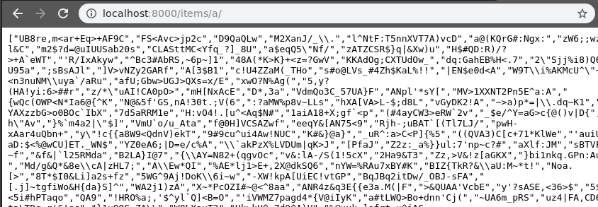
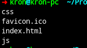

# Docker. Контейниризация только с помощью docker cli

[Docker](https://www.docker.com/) — это инструмент, предоставляющий удобный интерфейс для работы с контейнерами. Процессу, запущенному под Docker, кажется, что он работает в минимальном окружении, где помимо него есть только его дети. Хотя при этом процесс работает в той же операционной системе, что и остальные, нормальные, процессы, он просто их не видит, ровно как не видит файлов и всего остального за пределами своей «песочницы». Можно думать о Docker, как о прокачанном chroot.

#### Альтернативы и похожие на docker способы контейнеризации которые мне понравились но по моему мнению более тяжелые для изучения/разработки:

1. [vagrant](https://www.vagrantup.com/) - cli для запуска виртуальных машин поддерживает virtualbox, vmware, libvirt, docker 
2. [linuxcontainers](https://linuxcontainers.org/) - более больашя чем докер структура
3. [rkt](https://coreos.com/rkt/) - более современный и быстрый способ контейнеризации

## Установка

Установить докер можно по офф [документации](https://docs.docker.com/install/linux/docker-ce/ubuntu/)
Если нужно чтобы можно было запускать докер без sudo, то после установки в терминале нужно ввести
`sudo usermod -aG docker $USER` и перелогинится

## GUI приложения для использования docker

Вот неплохой обзор на [хабре](https://habr.com/ru/company/flant/blog/338332/)
Которые понравились мне

- [portainer](https://www.portainer.io/)
- [DockStation](https://dockstation.io/)
- [kitematic](https://kitematic.com/)

## Docker cli
C командой `docker` можно работать почти так же как с другими сервисными командами такими как service, systemctl

Расмотрим самые частые команды

- [docker start|rm|stop|restart имя контейнера](https://docs.docker.com/engine/reference/commandline/docker/) понятно из названия команды за что они отвечают
- [docker logs](https://docs.docker.com/engine/reference/commandline/logs/) показывает логи контейнера из /dev/stdout /dev/stderr
- [docker run](https://docs.docker.com/engine/reference/run/) с помощью этой команды мы запускаем контейнер главный параметр это название изображения например запустите `docker run hello-world` 
  у run есть самые честые опции
  1. `-d` - запуск контейнера как демона. По умолчанию контейнер запустится как shell программа и после закрытия щэла контейнер выключится это нужно чтобы запустить без доп команды `docker start имя контейнера`
  2. `-p внешний_порт:внутренний_порт` - указывает докеру какой порт провести во внешнюю сеть из докера, можно указывать несколько раз.
- [docker build](https://docs.docker.com/engine/reference/commandline/build/) собирает изображение по Dockerfile из текущего пути или с помоь опции `-f`

## Контейнеризация нашего прилоожения

Создадим Dockerfile для бэка и фронта.
Dockerfile это файл который запускает последовательно команды для создания изображения нашего контейнера.

---
### Бэк

Создадим Dockerfile в папке docker/backend пример [Dockerfile](../docker/backend/Dockerfile.example)  
Разберем некоторые строки, список всех команд можно найти [тут](https://docs.docker.com/engine/reference/builder/)

- В начале файла мы видим
  
   ```docker
   FROM python:3.7-alpine
   ```

  команда `FROM` говорит докеру на базе какого изображения будем строить свое, изображения можно найти в [docker hub](https://hub.docker.com/) или в своем приватном хабе.

- `ENV` команда проводит переменные окружения в изображения

- `RUN` команда запускает sh команды  

   ```docker
   RUN apk add --no-cache --update --virtual .build-deps  build-base \
       gcc \
       tzdata && pip install --upgrade pip && \
       cp /usr/share/zoneinfo/Europe/Moscow /etc/localtime \
       echo "Europe/Moscow" > /etc/timezone
   ```

   `--virtual .build-deps` говорит apk устанавливать все приложения в эту папку и проводить к ней PATH  
   `build-base gcc` нужны для сборки пакетов  
   `tzdata` нужна для указание даты контейнера  
   `cp /usr/share/zoneinfo/Europe/Moscow /etc/localtime && echo "Europe/Moscow" > /etc/timezone` делает чтобы таймзона была Москва (UTC+3)

- `WORKDIR` команда устнавливает папку в которой будем работаь по умолчанию
  
- `COPY` копирует данные из хоста в изображение. Есть еще команда `ADD` которая делает почти тоже самое так же распаковывает tar архивы и качает по url из-за этого медленее, по этой [ссылке](https://nickjanetakis.com/blog/docker-tip-2-the-difference-between-copy-and-add-in-a-dockerile) более подробно.

- ```docker
  RUN find /usr/local \
        \( -type d -a -name test -o -name tests \) \
        -o \( -type f -a -name '*.pyc' -o -name '*.pyo' \) \
        -exec rm -rf '{}' + &&\
    runDeps="$( \
        scanelf --needed --nobanner --recursive /usr/local \
                | awk '{ gsub(/,/, "\nso:", $2); print "so:" $2 }' \
                | sort -u \
                | xargs -r apk info --installed \
                | sort -u \
    )" \
    && apk add --virtual .rundeps $runDeps \
    && apk del --no-cache && apk del --no-cache .build-deps && rm -rf /var/cache/apk/*
  ``` 
  команда служит для удаление бинарников и не нужных файлов после установки пакетов, нужна чтобы наше изображение весило меньше.

- `EXPOSE` команда говрит какой порт по умолчанию делать видимым для других контейнеров
  
- `CMD` какую команду запускать по умолчанию при старте контейнер, есть еще `ENTRYPOINT` [тут](https://habr.com/ru/company/southbridge/blog/329138/) о разнице и какую когда применять(я за `CMD`).  
  
#### Запуск

1. Соберем изображение

    ```sh
    docker build  -f docker/backend/Dockerfile -t docker_example_backend_app .
    ```

2. Запускаем контейнер

    ```sh
    docker run --name example_backend -p 8000:8000 docker_example_backend_app
    ```

3. [Смотрим что все работет](http://localhost:8000/items/a/) примерно такое должны увидеть


4. Удаляем контейнер
   ```sh
   docker rm example_backend
   ```

---
### Фронт

Cоздадим Dockerfile в папке docker/frontend пример [Dockerfile](../docker/frontend/Dockerfile.example) он будет почти аналогичен что и для бека.


#### Запуск

1. Сборка

   ```sh
    docker build  -f docker/frontend/Dockerfile -t docker_example_frontend_app .
   ```

2. Проверка что все нормально собралось

   ```sh
   docker run --name example_frontend docker_example_frontend_app ls /app/dist
   ```

   такое должны увидеть  
   


---

### Nginx и коннечный вариант приложения

Cоздадим Dockerfile в папке docker/nginx пример [Dockerfile](../docker/nginx/Dockerfile.example).  
Расмотрим особенность `COPY --from=` позволяет копировать из изображения так же позволяет делать [multistage build](https://docs.docker.com/develop/develop-images/multistage-build/).  
Изменим dockerfile для backend чтобы задействовать multistage build

1. В строке `FROM python:3.7-alpine` добавляем название сборки получим `FROM python:3.7-alpine as compiler`
2. Около всех pip добавляем `--user`
3. После `pip install --user .` и до `CMD ["run_app"]` добавляем код

   ```docker
     FROM python:3.7-alpine as builder
     COPY --from=compiler /root/.local /root/.local
     COPY --from=compiler /etc/timezone /etc/timezone
     ENV PATH=/root/.local/bin:$PATH
   ```

Frontend менять незачем т.к. nginx использует почти multistage build просто в нескольких файлах

Конфиг nginx сделан чтобы можно было запускать не под рут пользователем.

Перейдем к конечному варианту запуска.

1. Создадим bridge network для общения между nginx и backend контейнером `docker network create example_docker`
2. Пересоберем, запустим и подключим к example_docker контейнер бека `docker build  -f docker/backend/Dockerfile -t docker_example_backend_app . && docker run -d --name example_backend --network=example_docker --network-alias=web docker_example_backend_app` если контейнер уже создан нужно его остановитьи удалить `docker stop example_backend && docker rm example_backend`
3. Пересобираем фронт, собираем nginx и запустим контейнер `docker build  -f docker/frontend/Dockerfile -t docker_example_frontend_app . && docker build  -f docker/nginx/Dockerfile -t docker_example_nginx_app . && docker run -d --name example_nginx --network=example_docker -p 8000:80 docker_example_nginx_app`
4. [Смотрим что все работет](http://localhost:8000/) примерно такое должны увидеть


Поздравляем мы запустили наш проект в  докере ^_^
[След](./docker_compose.md)