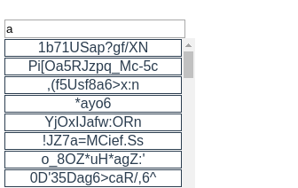

# Контейниризация с помощью docker-compose

[Docker-compose](https://docs.docker.com/compose/compose-file/) - утилита позволяющая создавать, собирать, запускать сервисы из нескольких контейнеров. 
Она упращает нам работу с докером без частых команд создания,сборки и т.п.
Конфигурация строиться yml файломпо умолчанию ищет docker-compose.yml в текущей папке.

## Установка
Самое удобное как обычнос офф [сайта](https://docs.docker.com/compose/install/)
Можно установить через pip `pip install docker-compose`

## Контейнеризация нашего прилоожения

Первое что нужно сделать это изменить [nginx Dockerfile](../docker/nginx/Dockerfile) на multistage build добавив в начало файла [frontend Dockerfile](../docker/frontend/Dockerfile) и сменив изображение из которого копируем данные

Cоздадим docker-compose.yml в папке docker пример [docker-compose.yml](../docker/docker-compose.yml.example).

Разберем команды:

- `version '3'` указывает какубюю версию yml конфига нужно будет воспринимать утилите
- `networks` тут перечисляем сети которые будем использовать
- `services` список сервисов  
  расмотрим сервис  
  - `container_name` имя контейнера
  - `build` указывает как будем собирать контейнер аналогично команде `docker build`
  - `restart` указывает политику перезапуска контейнера
  - `ports` показывает какие порты будут из вне как опция `-p` у `docker run`
  - `depends_on` показывает нам очередность запуска т.е. сначлаа запустится сервис из `depends_on` потом сам сервис т.к. по умолчанию сервисы создаются и запускаются в разнобой а могут быть зависемые сервисы
  - `networks` указывает в какие сети сможет иметь доступ сервис кстаит alias внутри сети по умолчанию это название сервиса
  - `logging` как будет логироваться докер контейнер

В yml файлах можно использовать переменные окружения

---
### Утилита docker-compose
С помощью этой утилиты мым ожем выполнять все операции что и утилита  `docker` но над сервисами из указанного файла.
Часты команды
- `up`  команда для запуска сервисов, моно указать конкретно какие запустить
  Важные опции
  - `-d` аналогично `docker run -d` только для сервисов
  - `--build` указываеь что нужно пересобрать контейнеры
- аналогичные docker команды управления сервисом start,stop,rm,restart

---
### Запуск
Давайте запустим наше приложение
1. `docker-compose -f docker/docker-compose.yml up -d --build`
2. [Смотрим что все работет](http://localhost:8000/) примерно такое должны увидеть

и все, не нужно запускать много команд а просто достуточно настроить один yml файл

---

### Чем мне не нравится использовать только docker-compsoe для прода

1. При старте сервисов все контейнеры выключаются
2. Если произошла ошибка старта контейнера ничего не вернется на место и придется перезапускать
3. Нельзя добавлять свои кастомные команды
4. Достаточно не удобная настройка через yml файл, приходится использовать либо очень много yml файлов либо альтернативные утилиты для проброса вирт окружений makefile,cmake и подобное

[След](./docker_swarm.md)