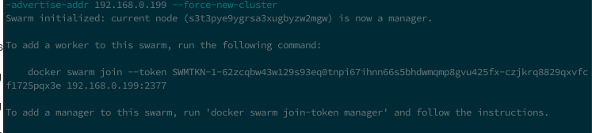
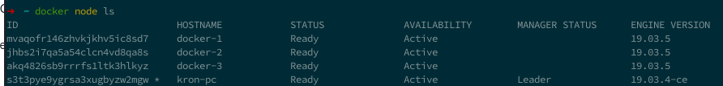
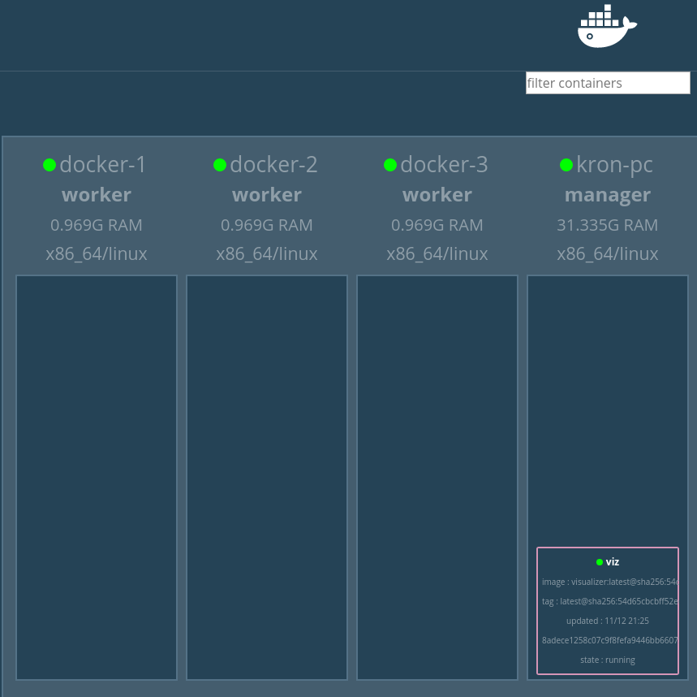
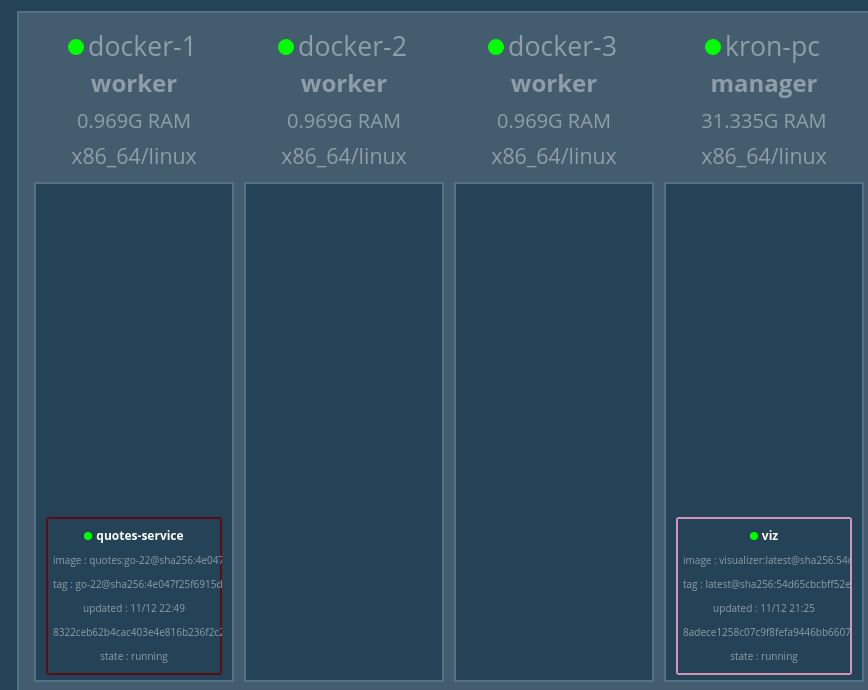
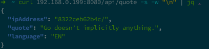
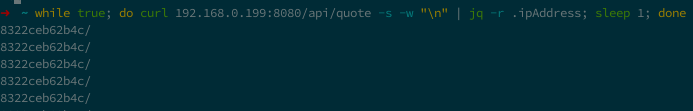
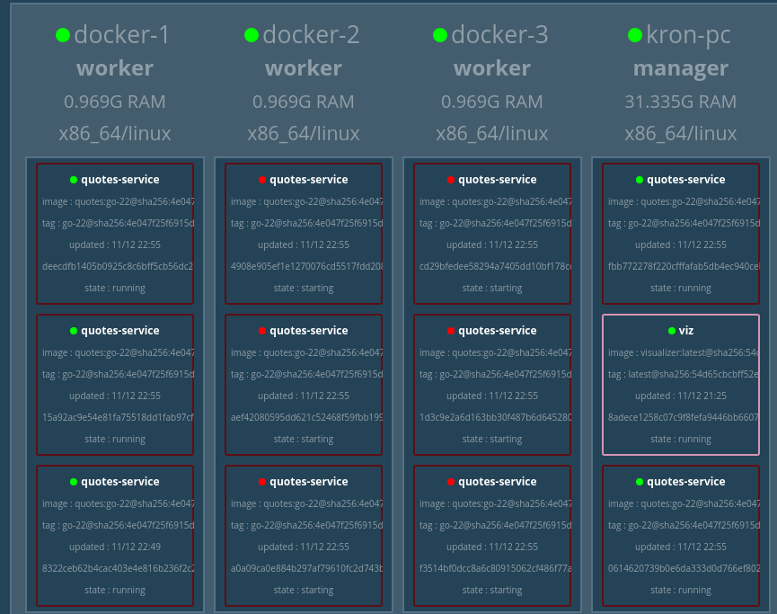
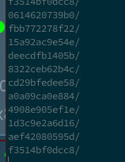
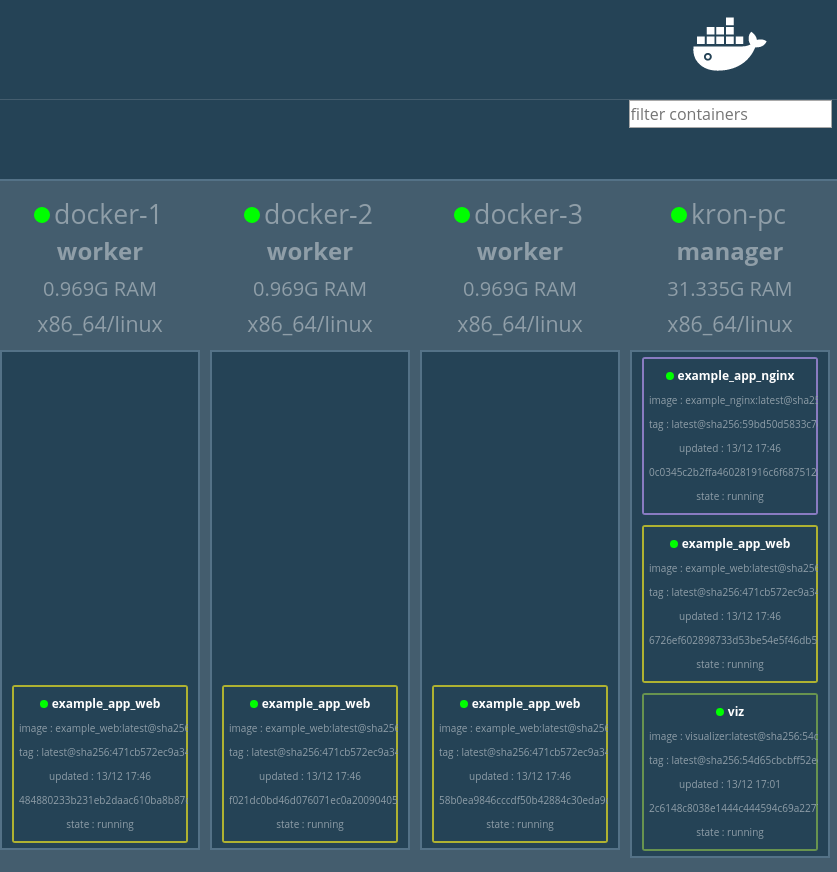

# Docker swarm mode. Разворачиваем в production среде.

[Docker swarm](https://docs.docker.com/engine/swarm/) - это средствео кластеризации ваших докер контейнеров управление обновление и т.п. 
Клстеризация в данном слуа это разбиение контейнеров по разным машинам(нодам), при  этом с помощью докера мы можем управлять тем как будут разворачиваться на машинах контейнеры.

Так же docker swarm берет на себя задачу маштабирования и балансировки запросов между нодами.
Очень хорошо показывает идею swarm в [этой](https://habr.com/ru/company/redmadrobot/blog/318866/) статье.

Перейдем к настройке.  
К сожалению по оф доке нельзя нормально настроть сварм для тестирования т.к. есть свою нюансы.

1. Убедитесь что у вас открыты порты 2377/tcp, 7946/tcp, 7946/udp, 4789/udp.  
   Открыть tcp порт

   ```sh
   iptables -I INPUT -p tcp --dport порт --syn -j ACCEPT
   ```

   Открыть udp порт

   ```sh
   iptables -I INPUT -p udp --dport порт -j ACCEPT
   ```

   Либо с помощью вашего firewall вот [примеры](https://www.digitalocean.com/community/tutorials/how-to-configure-the-linux-firewall-for-docker-swarm-on-ubuntu-16-04) некоторых

2. Забудьте про localhost и всегда смотри на свой ip, узнать свой ip можно с помощью ifconfig, ip addr и т.п.


## Поднятие swarm кластера на локальной машине.

1. Установите [virtualbox](https://www.virtualbox.org/wiki/Downloads) на вашу машину.
   - Чтобы упростить себе жизнь лучше так же установить [vagrant](https://www.vagrantup.com/docs/installation/) он нужен чтобы легко создать виртуальную машины и подклчатся  к ним.
2. 
   - Если установили vagrant запустите команду `vagrant up` в корне этого проекта.
   - Если нет
      1. Создайте виртуальные машины ubuntu или другой системы и настройте там сеть чтобы у каждой был свой ip
      2. Установите туда docker
      3. Сделайте хотя бы 3 клона вирт машины но с разными ip

3. На своем хосте в терминале наберите `docker swarm init --advertise-addr <ваш ip>` получите такой вывод 

4. Скопируйте такой
    `docker swarm join --token SWMTKN-1-62zcqbw43w129s93eq0tnpi67ihnn66s5bhdwmqmp8gvu425fx-czjkrq8829qxvfcf1725pqx3e 192.168.0.199:2377` код из консоли

5. Подклчюайтесь к каждой вирт машине и вводите то что скопировали из пункта 4. Если вы сделали через vagrant то просто команды `vagrant docker-1` docker-2 docker-3

Мы создали ваш докер кластер, давайте посмотрим на ваши ноды
`docker node ls` 

Запустим 1 сервис - визулизатор контейнеров
```sh
docker service create \
  --name=viz \
  --publish=8000:8080/tcp \
  --constraint=node.role==manager \
  --mount=type=bind,src=/var/run/docker.sock,dst=/var/run/docker.sock \
  dockersamples/visualizer
```

Перейдем на <ваш ip>:8000 и посмотри на ваш кластер


Давайте посмотрим на докер балансировку

1. Запустим сервис `docker service create --name quotes-service -p 8080:8080 magnuslarsson/quotes:go-22`

2. Установите jq,curl, подобная команда `apt install jq curl`

3. Давайте посмотрим что возвращает нам сервис  
   `curl <ваш ip>:8080/api/quote -s -w "\n" | jq .`  
   
    в дальнейшем будем парсить только ipAddress

4. Запустим множество запросов  
   `while true; do curl <ваш ip>:8080/api/quote -s -w "\n" | jq -r .ipAddress; sleep 1; done`  
   

5. Давайте изменим кол реплик у вашего сервиса  
   `docker service scale quotes-service=11 --detach=true`
   

6. Увидим что в респонсе стали появлятся другие ip значит балансировка работает, она будет работать даже если вырубятся воркеры все контейнеры распределятся между тем что осталось.
   

7. Удалим ваш сервис  
   `docker service rm quotes-service`


## Запуск вашего приложения в кластере

1. Настроим docker чтобы могли публиковать изображения на [docker hub](https://hub.docker.com/) нужно там зарегистрироваться и войти в консоли `docker login`
2. Обновим ваш [docker-compose](../docker/docker-compose.yml)
   - В сервис nginx добавим  

    ```yaml
    image: <ваш логин на docker hub>/example_nginx
    deploy:
    # нужно чтобы указать что nginx только на менеджере
      placement:
        constraints: [node.role == manager]
    
    # и поменяем публичный порт на 8001
    ports:
      - 8001:80 
    ```

    - В сервис web добавим  

    ```yaml
    image: <ваш логин на docker hub>/example_web
    deploy:
      mode: replicated
      replicas: 4
    ```

3. Закинем ваш сервис `docker-compose -f docker/docker-compose.yml build && docker-compose -f docker/docker-compose.yml push && docker stack deploy --compose-file docker/docker-compose.yml example_app`

4. Перейдем на <ваш ip>:8000 и посмотри на ваш кластер 

5. Смотрим что все работет на http://<ваш ip>:8001 примерно такое должны увидеть


---

### Плюсы и минусы docker swarm

#### Плюсы

1. Досточно удобно конфигурировать

2. Если какой-то воркер выклчюится контейнеры будут перенаправлены на другие рабочие воркеры

3. Можно настроить несколько реплик и трафик будет балансироватсья между ними.

#### Минусы

1. Балансировщик трафика неудобно конфигурировать, легче поставить nginx по верх докера и так настроить его.

2. Нет маштабирования репликаций контейнеров от нагрузки, нужно использовать сторонние вещи типо [этой](https://monitor.dockerflow.com/auto-scaling/)

3. Скудная документация и часто переплетается со старым способом создания кластеров на docker.
