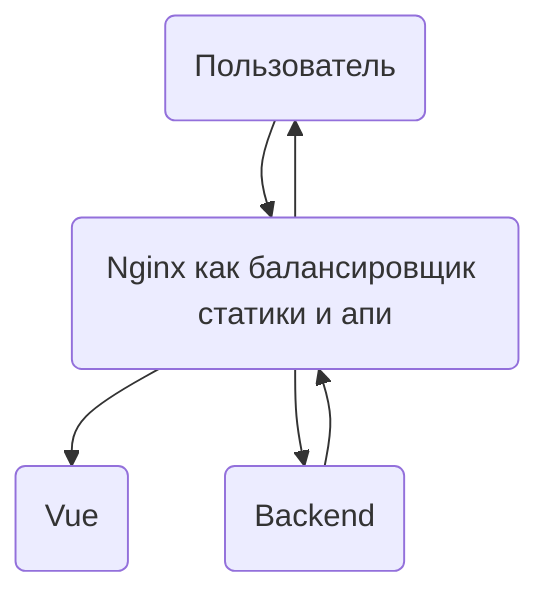

# Структура и создание проекта

Наше приложение будет состоять из бекенд и фронтенд части. 
Весь код в папке [app](../app) 
Схема в проде будет такая. 

---

## Запуск локально

1. Фронт в [app/frontend](../app/frontend) 
   1. `npm install`
   2. `npm run dev`
2. Бэк в [app/backend](../app/backend)

[След](./docker.md)